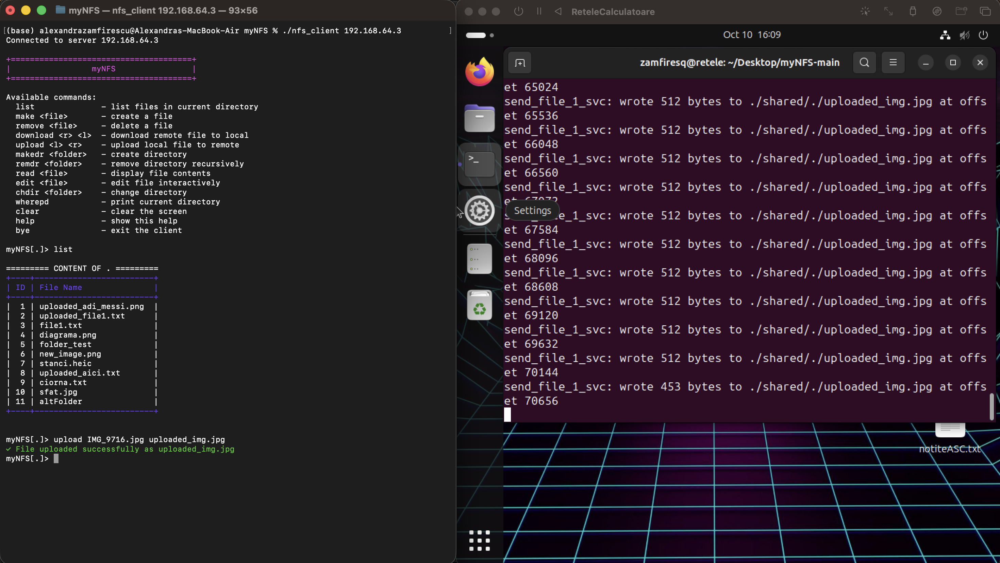

# myNFS-MacOS

This repository is based on **[myNFS-Linux](https://github.com/zamfiresq/myNFS-Linux)**, but adapted to run the **NFS client on macOS**. The core implementation comes from the Linux version, with necessary modifications to ensure compatibility on Mac.

## Features

- **NFS Client**: Run the NFS client on macOS, with support for basic NFS operations.
- **Cross-Platform Compatibility**: The client is designed to work on both Linux and macOS, with platform-specific adaptations.

## Prerequisites

- **macOS**: The client is designed to run on macOS.
- **NFS Server**: An NFS server must be set up and running to test the client. (Linux in this case)

## Building
To build the NFS client on macOS, follow these steps:
1. Clone the repository:
   ```bash
   git clone https://github.com/zamfiresq/myNFS-MacBook.git
   cd myNFS-MacBook
    ```
2. Build the project using `make`:
    ```bash
    make -f Makefile.mac
    ```

## Running the MacOS NFS Client -> Linux NFS Server
To run the NFS client on macOS, use the following command:
```bash
./nfs_client <server_ip> 
```
Replace `<server_ip>` with the IP address of your NFS server.

